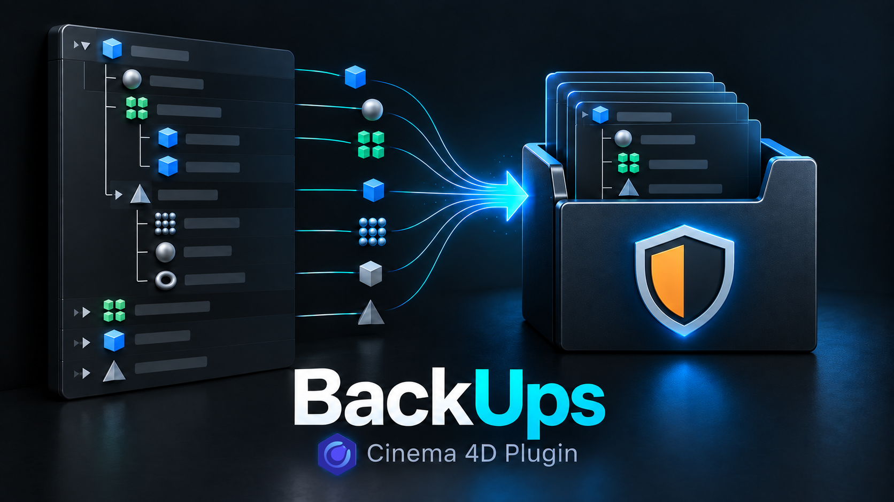

# BackUps



**BackUps** is a Cinema 4D plugin for moving objects and complete hierarchies
into a managed storage container inside the current scene. It can disable the
stored objects' generator flags, remember their previous states, restore those
states when objects leave the container, and automatically keep the container
folded in the Object Manager.

BackUps is an Object Manager workflow tool. It does **not** create external
files, scene versions, or automatic disk backups.

## History

The idea was inspired by
[Vault](https://ruimac.com/plugins.htm), an older Cinema 4D plugin that has not
been updated since 2012 and does not work with current Cinema 4D releases.

BackUps is an independent implementation created from scratch for modern
Cinema 4D. No original Vault source code was publicly available, and BackUps
does not contain code copied from the original plugin.

## Features

- Creates or reuses a top-level `BackUps` container in the current scene.
- Moves selected objects and complete hierarchies into the container.
- Optionally turns off supported green generator flags for every object in an
  incoming hierarchy.
- Records each object's original flag state and restores it when the object
  leaves its BackUps container.
- Preserves objects that were already disabled instead of enabling them on
  exit.
- Automatically folds the BackUps container when appropriate.
- Supports normal drag and drop, Ctrl-drag copies, nested hierarchy changes,
  Undo/Redo, saved scenes, and merged documents.
- Supports multiple independent BackUps containers after loading or merging
  scenes; each container keeps its own persistent identity.
- Uses no background timer or polling loop.

## Compatibility

- Tested with **Cinema 4D 2026.3.4** on **Windows 11**.
- Other Cinema 4D versions and operating systems have not yet been verified.

The distributed `.pypv` file contains protected Cinema 4D Python code. A new
build may be required when Cinema 4D changes its embedded Python version.

## Installation

1. Download the latest ZIP archive from
   [Releases](../../releases/latest).
2. Extract the complete `BackUps` folder into a Cinema 4D plugin directory.
3. Keep the folder structure unchanged:

   ```text
   BackUps/
   ├── BackUps.pypv
   └── res/
       └── icons/
           └── backups.png
   ```

4. Restart Cinema 4D.
5. Run `BackUps` from the Extensions menu or find it with Cinema 4D's
   Commander (`Shift+C`). The command can also be added to a palette or layout.

To locate the user plugin directory, open Cinema 4D Preferences, choose
**Open Preferences Folder**, and create a `plugins` folder there if necessary.
A custom plugin path can also be added in Cinema 4D Preferences.

## Usage

1. Select one or more objects or hierarchy roots.
2. Run the `BackUps` command.
3. The plugin creates the BackUps container when needed and moves the selected
   branches into it.
4. Drag objects out of BackUps when they are needed again. Their recorded
   generator states are restored automatically.

Additional objects can be added by running the command again or by dragging
them into BackUps in the Object Manager.

## Settings

Select the BackUps object to access its User Data settings.

### Keep Folded

Automatically folds the BackUps container after incoming drag-and-drop
operations and when the selection moves outside the stored hierarchy.

### Turn off Generators

Disables supported green generator flags when objects enter BackUps. The state
captured on entry is restored when each object leaves its owning container.

Changing this option affects objects that enter afterward. Existing stored
objects retain the states captured when they entered.

## Scene and Merge Behaviour

- Managed identity and generator-state information are stored persistently in
  the Cinema 4D scene.
- Renaming a BackUps object does not break its identity.
- Imported or merged BackUps containers are detected independently.
- If merged containers initially share an identity, the plugin separates them
  and rebinds their stored objects without recapturing generator states.
- The command adds new selections to the first managed top-level BackUps in
  the active document. Additional merged BackUps containers remain monitored
  independently.

## Notes and Limitations

- Keep managed BackUps objects at the top level of the Object Manager.
- Only objects exposing a supported visible green generator control are
  changed. Other objects are still stored normally.
- Cinema 4D controls the destination of ordinary Copy/Paste operations. If a
  pasted hierarchy appears outside BackUps, move it in with drag and drop or
  run the BackUps command.
- If the selection is already empty and BackUps is manually expanded, another
  click in empty space may not fold it because Cinema 4D emits no new selection
  change for an empty-to-empty click.
- BackUps is not a replacement for saving scenes, incremental saves, autosave,
  or external backup software.
- Save important work before testing any third-party plugin.

## Feedback and Testing

This is an initial public release intended for wider testing. Bug reports,
compatibility results, performance observations, and focused improvement ideas
are welcome in [GitHub Issues](../../issues).

Please include:

- Cinema 4D version and operating system;
- exact reproduction steps;
- whether the problem involves the command, drag and drop, Ctrl-drag,
  Undo/Redo, loading, or Merge;
- relevant Cinema 4D Console output;
- a minimal sample scene when practical.

Please do not upload confidential production scenes.

## Version History

### 1.0.1

- Fixed rollback so it executes only after the corresponding undo state has been closed with a single `EndUndo()` before `DoUndo()`.
- Prevented the BackUps command from re-adding objects that are already contained in any existing BackUps container.
- Replaced the custom node-alive check with Cinema 4D's native `IsAlive()` method.

### 1.0.0

- Initial public test release.
- Managed scene container with persistent ownership.
- Generator-state capture and exact restoration.
- Automatic Object Manager folding.
- Multi-hierarchy, Ctrl-drag, Undo/Redo, scene loading, and Merge handling.

## Copyright and License

Copyright © 2026 VitalS. All rights reserved.

BackUps is distributed as protected `.pypv` code and is not an open-source
project. The plugin is provided free of charge for use in personal and
commercial Cinema 4D projects. Redistribution, modification, resale,
repackaging, or publishing the plugin as part of another product without prior
permission is not allowed.

The plugin is provided **as is** and is used entirely at your own risk, without
warranty of any kind. The author is not responsible for data loss, damaged
scenes, production interruption, or any other direct or indirect damages.
Technical support, maintenance, compatibility fixes, and future updates are
not guaranteed.
